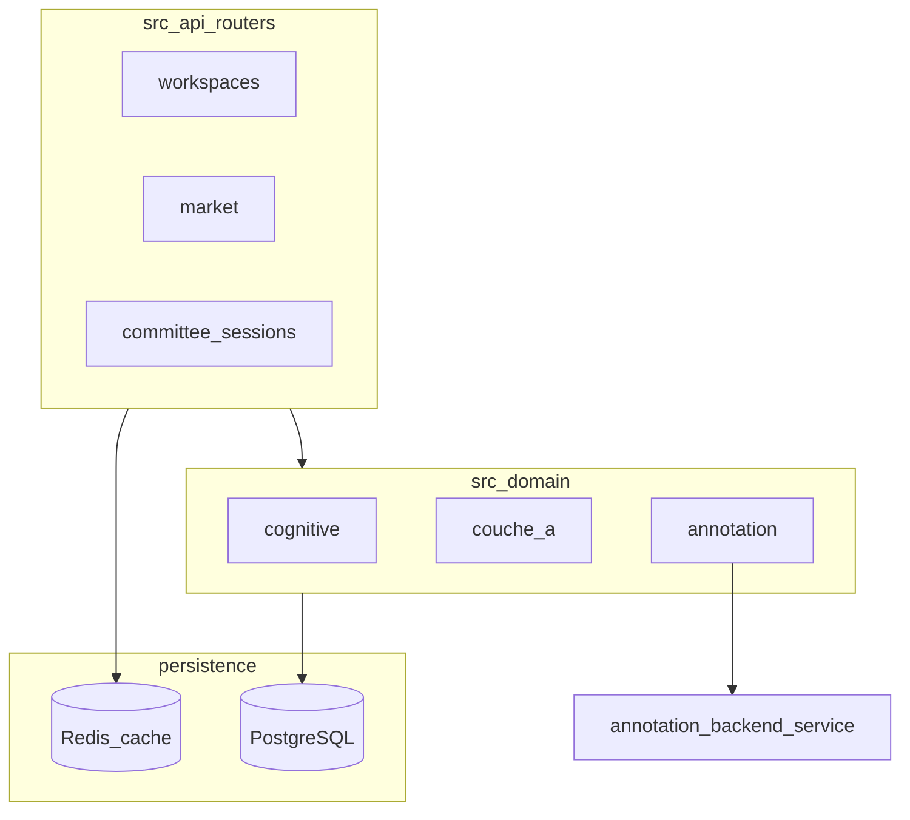

# P1 — Livrable 1 : Cartographie des modules

**Mesures** : script Python interne (comptage lignes/fichiers `.py`), 2026-04-06.

## 1. Volumes globaux (Python)

| Zone | Fichiers | Lignes (approx.) |
|------|----------|------------------|
| `src/` | 267 | **41 775** |
| `services/annotation-backend/` | 20 | **7 190** |
| `tests/` | 267 | **35 160** |
| `alembic/versions/` | 106 | **15 005** |
| `scripts/` | 184 | **30 242** |
| **Total (somme)** | — | **~129 372** |

Le mandat cite « 100K+ lignes » : **la somme `src` + annotation-backend + tests + alembic + scripts` dépasse 120K lignes Python** (hors `docs/`, hors autres langages).

---

## 2. Table par package top-level (`src/`)

| Module | Fichiers | Lignes | Responsabilité (une phrase) |
|--------|----------|--------|-----------------------------|
| `couche_a` | 50 | 10 039 | Pipeline scoring, comité, extraction typée, critères, upload, marché interne. |
| `procurement` | 39 | 7 982 | Dictionnaires, arbitrage LLM, profils M13, normalisation métier. |
| `annotation` | 19 | 3 559 | Orchestrateur M12, classifieur, pont Label Studio. |
| `api` | 28 | 4 785 | Routeurs FastAPI (workspaces, market, committee, WS, etc.). |
| `couche_b` | 23 | 3 789 | Mercuriale, résolveurs, ingestion couche B. |
| `memory` | 20 | 1 487 | Embeddings, RAG, index d’événements. |
| `services` (sous `src`) | 9 | 1 291 | Services transverses (PV, etc.). |
| `db` | 8 | 831 | Pools, schéma legacy `init_db_schema`, contexte tenant. |
| `cognitive` | 5 | 433 | État cognitif E0–E6, enveloppe confiance, evaluation frame. |
| `extraction` | 2 | 850 | Moteur extraction documents. |
| `workers` | 5 | 747 | Jobs ARQ / projecteurs. |
| `geo` | 6 | 498 | Géographie Mali / endpoints. |
| `vendors` | 7 | 539 | Fournisseurs / API. |
| `agents` | 4 | 493 | Agents (checkpoints). |
| `assembler` | 7 | 1 036 | Assemblage offres / bundles. |
| Autres (`core`, `mapping`, `evaluation`, `templates`, `utils`, …) | — | — | Voir dépôt pour le détail. |

**Dépendances internes** : pas de graphe automatique exhaustif dans ce livrable — les imports `src.X` sont la source ; un outil type `importlab` ou script d’agrégation peut produire une liste d’arêtes (approximatif si imports dynamiques).

---

## 3. Graphe haut niveau (Mermaid)

Les flèches indiquent une **dépendance logique** (API → services → DB), pas un appel unique.

---

## 4. Dépendances externes (principales)

Voir [`requirements.txt`](../../requirements.txt) — inclut notamment : FastAPI, uvicorn, psycopg, SQLAlchemy (si utilisé), jose (JWT), slowapi, mistralai, pydantic, etc.

---

## 5. Interfaces publiques

- **HTTP** : OpenAPI [`ANNEX_A_openapi.json`](ANNEX_A_openapi.json).
- **Python** : pas de package « public » unique ; les consommateurs internes importent `src.*` selon conventions du dépôt.

---

## 6. Tests et couverture

| Zone | Fichiers test | Lignes test |
|------|----------------|-------------|
| `tests/` | 267 | 35 160 |

**Couverture %** : **non mesuré automatiquement dans ce livrable** — voir CI ([`ci-main.yml`](../../.github/workflows/ci-main.yml)) pour la présence ou l’absence d’une étape `pytest-cov`.

---

## 7. Limitations

- Graphe inter-modules **intermédiaire** : pour une précision industrielle, générer un graphe d’imports (script dédié).
- `src/services` vs `services/annotation-backend` : deux racines ; ne pas les fusionner dans la comptabilité.
