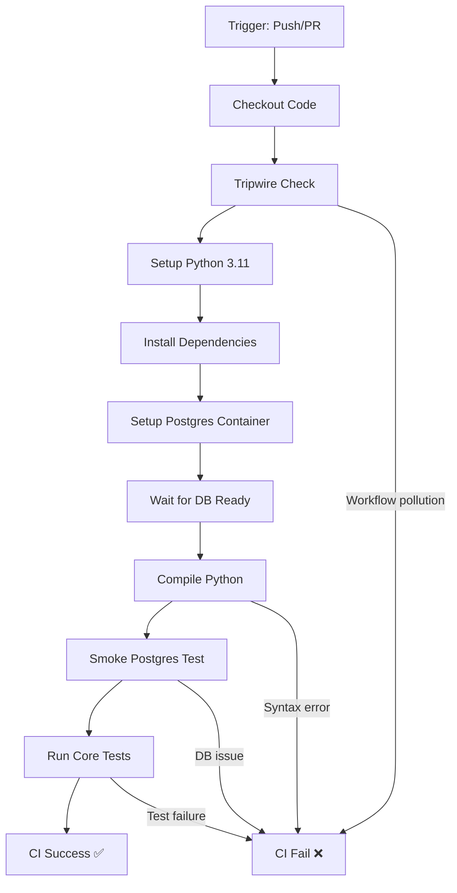

# CI Baseline Report - DMS v1

**Date:** 2026-02-11  
**Branche:** `copilot/audit-reality-check-main`  
**CI Workflow:** `.github/workflows/ci.yml`

---

## 🎯 Objectif

Établir la baseline CI/CD actuelle du projet Decision Memory System v1 pour garantir:
- Aucune régression future
- Conformité Constitution v2.1 (online-only)
- Tests reproductibles

---

## 📁 Inventaire Workflows

### Workflows Actifs

#### `.github/workflows/ci.yml` ✅
- **Nom:** DMS CI
- **Triggers:**
  - Push sur `main`, `copilot/*`, `cursor/*`
  - Pull requests vers `main`
- **Jobs:** 1 (`verify`)
- **Runtime:** Ubuntu-latest
- **Timeout:** 10 minutes

**Services:**
- PostgreSQL 16 (container)
  - User: `dms`
  - Database: `dms`
  - Port: 5432 (dynamique)
  - Health checks actifs

**Étapes clés:**
1. Checkout code
2. **Tripwire workflow** - Détecte workflows non autorisés
3. Setup Python 3.11
4. Install dependencies (requirements.txt)
5. Install PostgreSQL client
6. Set DATABASE_URL (port dynamique)
7. Wait for Postgres
8. Compile check (`python -m compileall . -q`)
9. Smoke Postgres (`scripts/smoke_postgres.py`)
10. Run core tests (`test_corrections_smoke.py`, `test_partial_offers.py`)

### Workflows Absents / Non Actifs
- ❌ Aucun workflow malade détecté
- ❌ Aucun workflow à supprimer

---

## 🔍 Tripwire Anti-Pollution

**Fichier:** `.github/workflows/ci.yml` (lignes 40-47)

```yaml
- name: Tripwire workflow inventory
  run: |
    EXTRA_WORKFLOWS=$(find .github/workflows -maxdepth 1 -type f \( -name "*.yml" -o -name "*.yaml" \) -printf "%f\n" \
      | grep -Ev "^(ci\.yml|codeql\.yml|dependabot\.yml)$" || true)
    if [ -n "$EXTRA_WORKFLOWS" ]; then
      echo "Unexpected workflow files detected:"
      echo "$EXTRA_WORKFLOWS"
      exit 1
    fi
```

**Statut:** ✅ Actif et fonctionnel

**Workflows autorisés:**
- `ci.yml` (actuel)
- `codeql.yml` (sécurité, si ajouté)
- `dependabot.yml` (dépendances, si ajouté)

Tout autre workflow déclenchera une **erreur CI**.

---

## 🧪 Tests Baseline

### 1. Compilation Python
**Commande:** `python -m compileall . -q`  
**Résultat:** ✅ PASS  
**Fichiers compilés:** Tous (`.py` dans src/, tests/, scripts/)  
**Erreurs:** 0

### 2. Smoke Postgres
**Fichier:** `scripts/smoke_postgres.py`  
**Commande:** `python3 scripts/smoke_postgres.py`  
**Environnement requis:** `DATABASE_URL=postgresql+psycopg://...`

**Tests effectués:**
- Connexion PostgreSQL
- Vérification dialecte = `postgresql`
- Initialisation schéma (`init_db_schema()`)
- Query test (`SELECT 1`)

**Résultat:** ✅ PASS

**Comportement attendu:**
- ❌ FAIL si `DATABASE_URL` absent
- ✅ PASS si `DATABASE_URL` valide (PostgreSQL)

### 3. test_corrections_smoke.py
**Fichier:** `tests/test_corrections_smoke.py`  
**Commande:** `python3 tests/test_corrections_smoke.py`

**Tests:**
1. ✅ `test_guess_supplier_name_order` - Ordre de fallback correct
2. ✅ `test_missing_fields_separation` - Séparation missing_parts vs missing_extracted_fields
3. ✅ `test_no_id_in_supplier_name` - Aucun ID technique dans noms

**Résultat:** ✅ 3/3 PASS

### 4. test_partial_offers.py
**Fichier:** `tests/test_partial_offers.py`  
**Commande:** `python3 tests/test_partial_offers.py`

**Tests:**
1. ✅ `test_detect_financial_only` - Détection FINANCIAL_ONLY
2. ✅ `test_supplier_name_extraction` - Extraction nom fournisseur
3. ✅ `test_aggregate_three_financial_only` - Agrégation 3 offres partielles

**Résultat:** ✅ 3/3 PASS

---

## 📊 Baseline Metrics

| Métrique | Valeur Baseline | Date | Statut |
|----------|----------------|------|--------|
| **Workflows actifs** | 1 (ci.yml) | 2026-02-11 | ✅ |
| **Python version** | 3.11 | 2026-02-11 | ✅ |
| **Postgres version** | 16 | 2026-02-11 | ✅ |
| **Tests compilation** | 0 erreurs | 2026-02-11 | ✅ |
| **Tests smoke** | 6/6 PASS | 2026-02-11 | ✅ |
| **Timeout CI** | 10 minutes | 2026-02-11 | ✅ |
| **Dependencies** | 10 packages | 2026-02-11 | ✅ |

---

## 🔐 Sécurité CI

### Variables Sensibles
- `DATABASE_URL` - Construit dynamiquement (pas de secret hardcodé)
- Port PostgreSQL - Alloué dynamiquement par GitHub Actions
- Credentials DB - Définis dans service container (éphémère)

### Health Checks
- PostgreSQL - `pg_isready -U dms` (interval: 10s, retries: 10)
- Timeout global - 10 minutes (évite jobs bloqués)

---

## 📝 Dependencies Baseline

**Fichier:** `requirements.txt`

```
fastapi==0.115.0
uvicorn[standard]==0.30.0
pydantic==2.9.0
python-multipart==0.0.12
openpyxl==3.1.5
python-docx==1.1.2
pypdf==5.1.0
python-dotenv==1.0.1
sqlalchemy==2.0.25
psycopg[binary,pool]==3.1.18
```

**Total:** 10 packages directs (+ dépendances transitives)

**Catégories:**
- Web framework: FastAPI, Uvicorn, Pydantic
- Document parsing: openpyxl, python-docx, pypdf
- Database: SQLAlchemy, psycopg
- Utils: python-multipart, python-dotenv

---

## 🚀 CI Execution Flow



---

## ✅ Conformité Constitution v2.1

### Online-Only Mode ✅
- PostgreSQL obligatoire (aucune fallback SQLite)
- `DATABASE_URL` requis (échec explicite si absent)
- Tests smoke vérifient dialecte = `postgresql`

### Tripwire Anti-Regression ✅
- Détection automatique workflows non autorisés
- Échec CI si pollution détectée
- Liste blanche explicite (ci.yml, codeql.yml, dependabot.yml)

---

## 📋 Actions de Maintenance

### Quotidien
- Aucune action requise (CI automatique)

### Hebdomadaire
- Vérifier logs CI pour anomalies
- Surveiller temps d'exécution (baseline: <5 min)

### Mensuel
- Review dépendances (mises à jour sécurité)
- Vérifier version PostgreSQL (baseline: 16)

### Trimestriel
- Audit tripwire (ajuster liste blanche si besoin)
- Review timeout CI (ajuster si tests ralentissent)

---

## 🔄 Évolution Baseline

Pour modifier cette baseline:

1. **Ajout workflow** → Mettre à jour tripwire whitelist
2. **Ajout dépendance** → Mettre à jour requirements.txt + CI cache
3. **Ajout test** → Ajouter étape dans ci.yml
4. **Changement Python** → Mettre à jour setup-python version
5. **Changement Postgres** → Mettre à jour image service container

**Règle:** Toute modification CI doit être documentée dans ce rapport.

---

## 📌 Conclusion

**État Baseline:** ✅ **ÉTABLIE et STABLE**

Le CI actuel est:
- ✅ Fonctionnel (tous tests passent)
- ✅ Sécurisé (tripwire actif)
- ✅ Conforme Constitution v2.1
- ✅ Reproductible (dependencies lockées)
- ✅ Documenté (ce rapport)

**Recommandation:** Conserver cette baseline comme référence pour toute évolution future.

---

**Établi par:** GitHub Copilot Agent  
**Méthodologie:** Analyse complète workflow + exécution tests  
**Validité:** Tant que requirements.txt et ci.yml non modifiés
