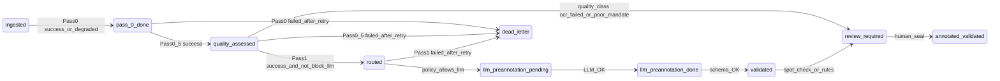

# ANNOTATION_ORCHESTRATOR_FSM — Machine à états (pipeline annotation)

**Version** : `1.0.0`  
**Date** : 2026-03-24  
**Subordonné** : [PASS_OUTPUT_STANDARD.md](./PASS_OUTPUT_STANDARD.md), contrats Pass 0 / 0.5 / 1

---

## 1. États (`AnnotationPipelineState`)

| État | Description |
| --- | --- |
| `ingested` | Document connu ; texte brut ou URI stockage disponible |
| `pass_0_done` | Pass 0 (ingestion) a produit `AnnotationPassOutput` `success` ou `degraded` avec `normalized_text` non vide |
| `quality_assessed` | Pass 0.5 a produit une `quality_class` |
| `routed` | Pass 1 a produit `document_role` / `taxonomy_core` |
| `llm_preannotation_pending` | En attente d’appel LLM (si non bloqué) |
| `llm_preannotation_done` | JSON brut LLM disponible |
| `validated` | Validation déterministe (Pydantic / règles locales) OK |
| `review_required` | Sortie LS / humain requis |
| `annotated_validated` | Ground truth humain scellé (RÈGLE-25) |
| `rejected` | Document exclu du corpus |
| `dead_letter` | Échec non récupérable après retries |

---

## 2. Transitions principales

*(Diagramme indicatif — l’implémentation peut regrouper `llm_*` dans l’adapter LS.)*

---

## 3. Garde-fous

| Garde | Action |
| --- | --- |
| Pass 0.5 `block_llm = true` | Interdire transition vers `llm_preannotation_pending` |
| `quality_class = ocr_failed` | Forcer `review_required` ou `rejected` selon mandat |
| Timeout passe | Retry `N` fois (défaut **2**) puis `dead_letter` ou `review_required` |

---

## 4. Timeouts recommandés (ms) — à ajuster par mandat

| Passe | Timeout ms | Notes |
| --- | ---: | --- |
| Pass 0 | 60_000 | I/O + normalisation |
| Pass 0.5 | 5_000 | CPU seul |
| Pass 1 (déterministe) | 5_000 | Regex |
| Pass 1 (LLM) | 120_000 | Aligné `ANNOTATION_TIMEOUT` backend |

---

## 5. Persistance

- **Minimal** : `run_id` + état courant + derniers `AnnotationPassOutput` sérialisés (JSON) par document.
- **Enterprise** : table `annotation_pipeline_runs` (mandat Alembic séparé).

---

## 6. Observabilité obligatoire par transition

Journaliser : `run_id`, `document_id`, `from_state`, `to_state`, `pass_name`, `duration_ms`, `status`, `error_codes`.
