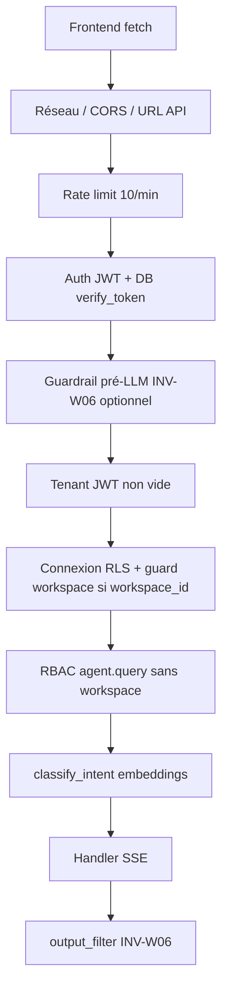

# Investigation — Chaîne de blocage de l’assistant DMS (jusqu’aux invariants)

**Date** : 2026-04-11  
**Contexte** : analyse avant merge de la PR « INV-W06 pré-LLM désactivé par défaut + parsing 422 » — ce document décrit **toutes** les raisons possibles qu’un utilisateur « ne puisse pas utiliser l’agent » ou reçoive un refus, de la couche navigateur jusqu’aux invariants canon.

**Périmètre** : `POST /api/agent/prompt` (`src/api/routers/agent.py`), dépendances auth/RLS, routeur sémantique, handlers, filtre de sortie, RBAC documenté.

---

## 1. Vue d’ensemble (ordre d’exécution réel)

Un « blocage » peut être : **HTTP d’erreur** (4xx/5xx), **stream SSE** avec message d’erreur ou de refus, ou **réponse dégradée** (fallback LLM / texte statique).

---

## 2. Couche navigateur et transport (hors FastAPI)

| Cause | Symptôme | Remède indicatif |
|--------|-----------|------------------|
| Mauvaise `NEXT_PUBLIC_API_URL` (ex. localhost en prod) | `fetch` échoue, message réseau côté `api-client` | Rebuild frontend avec URL HTTPS publique de l’API |
| CORS : origine front absente de `CORS_ORIGINS` | Navigateur bloque la requête | Ajouter l’origine exacte côté API |
| Mixed content (page HTTPS, API HTTP) | Blocage navigateur | API en HTTPS |
| Corps JSON invalide / `workspace_id` non UUID | **422** validation Pydantic | Corriger le payload ; le front distingue désormais ce 422 du guardrail |

**Invariant** : aucun — configuration déploiement.

---

## 3. Limite de débit

| Fichier | Règle |
|---------|--------|
| `src/ratelimit.py` | `LIMIT_ANNOTATION = "10/minute"` sur `agent_prompt` |

Dépassement → **429** (SlowAPI). Stockage Redis si `REDIS_URL` défini, sinon mémoire (non persistant).

---

## 4. Authentification et tenant

| Étape | Fichier | Résultat si échec |
|-------|---------|-------------------|
| Bearer absent / invalide / expiré / révoqué | `src/couche_a/auth/dependencies.py` (`get_current_user`) | **401** |
| Rôle JWT absent de `ROLES` | idem | **401** |
| `DATABASE_URL` vide au moment de la dépendance | idem | **500** configuration |
| `tenant_id` absent après résolution (`UserClaims`) | `src/api/routers/agent.py` | **400** « tenant_id manquant dans le JWT » |

**Invariant** : session valide et tenant résolu pour ouvrir `acquire_with_rls`.

---

## 5. Garde-fou pré-LLM INV-W06 (recommandation sémantique)

| Condition | Résultat |
|-----------|----------|
| `AGENT_INV_W06_PRE_LLM_BLOCK=false` (**défaut**, dette **TD-AGENT-01**) | Aucun blocage ici ; pas d’embedding dans `check_recommendation_guardrail`. |
| `AGENT_INV_W06_PRE_LLM_BLOCK=true` + requête ressemble à un **prix factuel** | Court-circuit `looks_like_factual_market_price_query` → pas de blocage (`src/agent/guardrail.py`). |
| Flag **true** + intent `RECOMMENDATION` avec confiance ≥ **0,85** | **422** JSON `guardrail_inv_w06` |

**Lien invariant** : aligné sur **INV-W06** / **RÈGLE-09** (pas de prescription de choix) — appliqué ici en **refus avant LLM** si le flag est activé.

---

## 6. Autorisation workspace et permission `agent.query`

### 6.1 Requête **avec** `workspace_id`

`guard()` (`src/auth/guard.py`) :

1. **Membre actif** (`workspace_memberships`, `revoked_at IS NULL`) — sinon **403** « pas membre ».  
   - Exception pilote : `WORKSPACE_ACCESS_JWT_FALLBACK` peut simuler l’accès lecture pour certains rôles JWT legacy (les **écritures** restent refusées sans membership).
2. **Permission** : le rôle effectif (V5.2 ou legacy mappé) doit inclure **`agent.query`** — sinon **403** avec détail rôle/permission.
3. **Scellement** : `agent.query` n’est pas dans `WRITE_PERMISSIONS` → pas de **409** « workspace clos » pour cette permission (le seal protège surtout les écritures).

### 6.2 Requête **sans** `workspace_id` (assistant « global »)

`ROLE_PERMISSIONS` (`src/auth/permissions.py`) : il faut **`agent.query`** ou **`system.admin`**.

Rôles **sans** `agent.query` (donc **403** en mode global) :

- **`technical`** (retiré volontairement en V5.2 — évaluateur hors périmètre IA).
- **`observer`** (lecture seule dossier, pas d’agent global).

Les autres rôles métier listés dans la matrice incluent `agent.query` (sauf exceptions ci-dessus).

**Invariant** : Canon RBAC V5.2 — la matrice 18×6 est la source de vérité permissions.

---

## 7. Routeur sémantique (pas un HTTP block, mais un « tuyau » vers refus ou mauvaise voie)

Fichier : `src/agent/semantic_router.py`.

| Issue | Effet |
|-------|--------|
| **MISTRAL_API_KEY** absente ou SDK absent | `get_embedding` en **fallback** déterministe (hash) → similarités peu représentatives → mauvaise intent, plus d’**OUT_OF_SCOPE** ou confusion marché / recommandation. |
| Meilleur intent **RECOMMENDATION** avec sim ≥ **0,85** | Retour classification RECOMMENDATION (le **tie-break** marché vs reco peut repousser vers `MARKET_QUERY` si écart ≤ 0,08 et marché ≥ 0,75). |
| Meilleur score **< 0,75** (hors cas REC ci-dessus) | `OUT_OF_SCOPE` |

**Routage dans `agent.py`** : seuls `MARKET_QUERY`, `WORKSPACE_STATUS`, `PROCESS_INFO` ont un handler dédié ; **tout le reste** (dont **`RECOMMENDATION`**) tombe sur **`static_refusal_handler`**.

Conséquence : avec le pré-LLM **désactivé**, une question classée « recommandation » ne reçoit **pas** un 422 explicite, mais un **message générique de hors-périmètre** — blocage **UX** plutôt que HTTP.

**Invariant** : **INV-A03** — routing sémantique (pas de regex seule pour l’intent).

---

## 8. Handlers métier (stream SSE)

Fichier : `src/agent/handlers.py`.

| Handler | Blocage ou dégradation |
|---------|-------------------------|
| **MQL** | Si aucune source : message fixe « Aucune donnée de marché… » (pas d’exception HTTP). |
| **Workspace status** | Sans `workspace_id` : message pour ouvrir un dossier. Workspace inconnu : « introuvable ». |
| **Process info** | Appel LLM (voir §9). |
| **Static refusal** | Texte statique hors périmètre (OUT_OF_SCOPE, RECOMMENDATION, etc.). |

Exception non gérée dans le générateur SSE → événement `type: "error"` + trace erreur ; le outer `agent_prompt` peut remonter **500** si l’exception sort du générateur selon le cas.

---

## 9. Mistral LLM et circuit breaker

Fichiers : `src/agent/llm_client.py`, `src/agent/circuit_breaker.py`.

| Condition | Effet |
|-----------|--------|
| Pas de clé / pas de SDK | **Fallback** : un court message statique + **`record_failure`** sur le breaker (risque de bascule vers modèle fallback après seuils). |
| Erreur API Mistral | Failures enregistrées ; comportement selon breaker (modèle large en secours). |

**Invariant** : traçabilité **INV-A06** (échecs reflétés dans le breaker) — pas un invariant « kill list », mais fiabilité opérationnelle.

---

## 10. Filtre de sortie INV-W06 (post-LLM)

Fichier : `src/agent/output_filter.py`.

- **Ne coupe pas** le stream : remplace les segments matchant des motifs interdits (winner, ranking, gagnant, « meilleur fournisseur », etc.) par `[CONTENU FILTRÉ — INV-W06]`.
- Log warning côté serveur si filtrage.

**Invariant** : **INV-W06** / **RÈGLE-09 V4.1.0** — zéro prescription de choix, classement ou gagnant dans la **sortie** textuelle, en complément du garde-fou d’entrée optionnel.

---

## 11. Invariants et docs gelées (hors route agent mais même famille INV-W06)

Ces règles **ne bloquent pas directement** `POST /agent/prompt`, mais définissent le cadre « décision / mémoire » :

- Pas de champs **winner / rank / recommendation / best_offer** dans les payloads d’évaluation, PV, etc. (kill-list, `pv_builder`, routes workspace).
- Contraintes CHECK / intégrité DB sur snapshots (tests `test_no_winner_check`, etc.).

Références : `docs/freeze/DMS_V4.2.0_INVARIANTS.md`, **INV-W06** dans le canon V5.1, **RÈGLE-09** dans `CLAUDE.md` / anchor.

---

## 12. Synthèse — causes les plus fréquentes en production

1. **403** : rôle **observer** ou **technical** en mode **sans workspace** ; ou utilisateur **non membre** du workspace ; ou rôle **sans** `agent.query` sur le workspace.  
2. **422** : validation Pydantic (**UUID** `workspace_id`) — à ne pas confondre avec le guardrail ; ou guardrail pré-LLM si `AGENT_INV_W06_PRE_LLM_BLOCK=true`.  
3. **401** : session expirée ou token invalide.  
4. **429** : burst > 10 requêtes/minute sur l’agent.  
5. **« L’agent ne répond pas utilement »** sans 4xx : **OUT_OF_SCOPE** / **static_refusal** (routing embedding faible ou question hors centroïdes) ; **RECOMMENDATION** routée vers refus statique si pré-LLM off ; **MQL** sans données ; **Mistral** en fallback.

---

## 13. Fichiers de référence rapide

| Sujet | Fichiers |
|--------|----------|
| Route agent | `src/api/routers/agent.py` |
| Pré-LLM + lexicon prix | `src/agent/guardrail.py`, `src/agent/market_query_lexicon.py` |
| Flag env | `src/core/config.py` (`AGENT_INV_W06_PRE_LLM_BLOCK`) |
| Routeur | `src/agent/semantic_router.py`, `src/agent/embedding_client.py` |
| Handlers | `src/agent/handlers.py` |
| Filtre sortie | `src/agent/output_filter.py` |
| RBAC | `src/auth/permissions.py`, `src/auth/guard.py` |
| Auth | `src/couche_a/auth/dependencies.py` |
| Dette pré-LLM | `docs/ops/TECHNICAL_DEBT.md` (TD-AGENT-01) |
| Confusion 422 UI | `docs/ops/INV_W06_ASSISTANT_BLOCKED_INVESTIGATION.md` |

---

*Document d’audit technique — à joindre aux revues de PR agent / INV-W06.*
